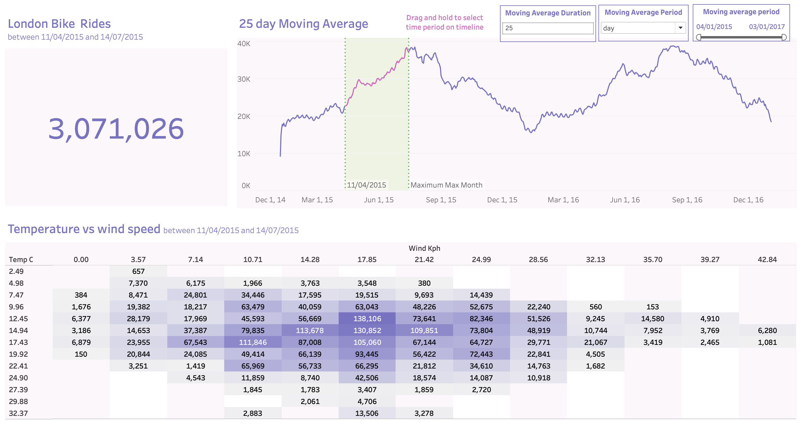

# London Bike Rides Data Analysis and Visualization Project

This project demonstrates the end-to-end process of gathering, exploring, manipulating, and visualizing the London Bike Sharing dataset. The objective was to create a dynamic and interactive dashboard using Python and Tableau, providing insights into the number of bike rides, moving averages, and the relationships between temperature and wind speed.

## Dashboard Preview


## Overview

The project consists of the following steps:

1. **Data Gathering:**

   - The dataset was programmatically downloaded using the Kaggle API.
   - The raw data was provided in a ZIP format and extracted into a CSV file.

2. **Data Exploration and Manipulation:**

   - The data was explored and assessed using Python libraries such as Pandas.
   - Necessary transformations included:
     - Renaming columns for better readability.
     - Converting humidity percentages to appropriate values.
     - Mapping numerical codes for weather and season to descriptive labels.
   - The cleaned dataset was saved as an Excel file named `london_bikes_final.xlsx`.

3. **Data Visualization:**

   - Tableau was used to create an interactive dashboard with the following visualizations:
     - **Total Rides:** Displays the total number of bike rides within a selected date range.
     - **Moving Average Chart:** The main visualization showing the moving average of bike rides over time with dynamic parameters.
     - **Heatmap:** Depicts the relationship between temperature and wind speed.
     - **Bar Charts:** Tooltip-based visualizations showing bike rides split by weather and hour.

---

## Project Files

- **Python Code:** `LondonBikesRides.ipynb` – Jupyter Notebook containing the Python code for data gathering, exploration, and manipulation.
- **Raw Data:**
  - `london-bike-sharing-dataset.zip` – Compressed file containing the original dataset.
  - `london_merged.csv` – Extracted CSV file.
- **Cleaned Data:** `london_bikes_final.xlsx` – Final cleaned dataset used for Tableau visualizations.
- **Tableau Workbook:** `London Bike Rides.twb` – Tableau workbook containing the dashboard.
- **Screenshot:** `Screenshot.png` – Example view of the Tableau dashboard.

---

## Tools and Technologies

### Programming and Libraries

- **Python:** Used for data manipulation and cleaning.
  - Libraries:
    - `pandas`: Data manipulation.
    - `zipfile`: Extracting data.
    - `kaggle`: API integration for downloading data.

### Data Visualization

- **Tableau:**
  - Created an interactive dashboard with dynamic parameters, set actions, and calculated fields.

---

## Steps to Recreate the Project

### 1. Data Preparation

1. Install the required Python libraries:
   ```bash
   pip install pandas kaggle
   ```
2. Use the Kaggle API to download the dataset:
   - Follow the [official Kaggle API documentation](https://www.kaggle.com/docs/api) to set up API credentials.
   - Run the Python script provided in the notebook to download and extract the data.
3. Use the provided code in the Jupyter Notebook to clean and preprocess the dataset.
4. Save the cleaned data as an Excel file.

### 2. Tableau Visualization

1. Open Tableau and connect to the cleaned dataset (`london_bikes_final.xlsx`).
2. Create the following visualizations:
   - **Moving Average Chart:** Use calculated fields and parameters for dynamic moving averages.
   - **Heatmap:** Create bins for temperature and wind speed and map the counts.
   - **Bar Charts:** Visualize bike rides split by weather and hour.
   - **Dashboard:** Combine all visualizations into an interactive layout.

---

## Key Features of the Dashboard

1. **Dynamic Moving Average:**
   - Adjustable parameters for duration (e.g., day, week, month) and period.
2. **Heatmap Insights:**
   - Interactive chart showing how temperature and wind speed impact bike rides.
3. **Tooltips:**
   - Additional insights on bike rides by weather and hour.
4. **Filters:**
   - Dynamically select and filter date ranges.

---

## Insights:
  - Bike rides increase during warmer temperatures and lower wind speeds.
  - Moving averages provide a clear trend of bike usage over time.

---

## Conclusion

This project highlights how to effectively process, analyze, and visualize data to derive meaningful insights. It combines Python’s data manipulation capabilities with Tableau’s powerful visualization tools to create a comprehensive and interactive dashboard for analysis.
